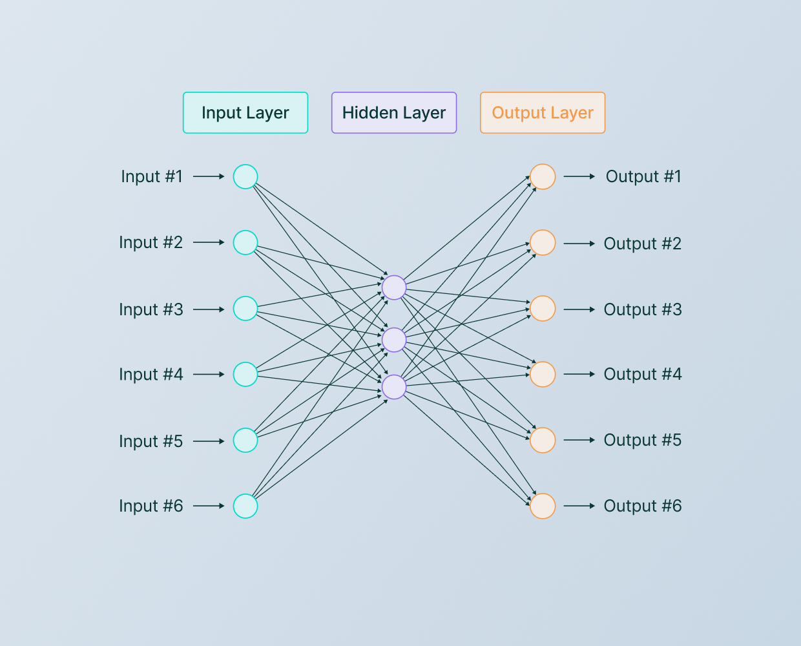

# Redes Neurais

## Algoritmos de Machine Learning

| Tipo            | Exemplo 1           | Exemplo 2            |
| --------------- | ------------------- | -------------------- |
| Regression      | Logistic Regression | Linear Regression    |
| Decision Tree   | CART                | ID3                  |
| Clustering      | Naive Bayes         | Gaussian Naive Bayes |
| Neural Networks | Back Propagation    | Convolution (CNN)    |

## Conceitos de redes neurais

### Hiperparâmetros

Parâmetros que diferem em cada rede que influenciam o treinamento da mesma.

Parâmetros obrigatórios:

* Número de input nodes;
* Número de hidden layers;
* Número de hidden nodes nas hidden layers;
* Número de output nodes;
* Weights;
* Bias;
* Learning Rate.


Input nodes representa uma feature. Supondo uma rede neural de reconhecimento de imagem, cada input node corresponderia a um pixel de imagem.


***

Uma rede neural contém 3 partes: _input layer, hidden layer e output layer_.

<figure><figcaption>
Layers de rede neural
</figcaption></figure>

As redes neurais pode ser do tipo:

1. Feedforward: Os sinais trafegam em uma só direção, da Input Layer a Output Layer. Exemplo: **convolution neural network** **(CNN ou ConvNet)**;
2. Feedback: Os sinais Trafegam em ambas as diferentes. Exemplo: **recurrent neural networks (RNN).**

## Matemática de Redes Neurais


Dividida em 5 partes: propagação, cálculo do erro, cálculo dos gradientes, checagem dos gradientes, atualização dos pesos.


### Forward Propagation

Dividida em 2 etapas: **operação de soma** e **função de ativação**.

Cada nó na hidden layer ou output layer usará o operador de soma para somar todos os inputs conectado a ele e produzir um **net input**.

$$
netinput=bias+\sum x*w
$$

em que _x_ é o nó em questão e _w_ é o peso do nó.

O resultado da operação de soma é usado na **função de ativação**.

<figure><figcaption>
Funções de Ativação
</figcaption></figure>

### Cálculo do Erro
