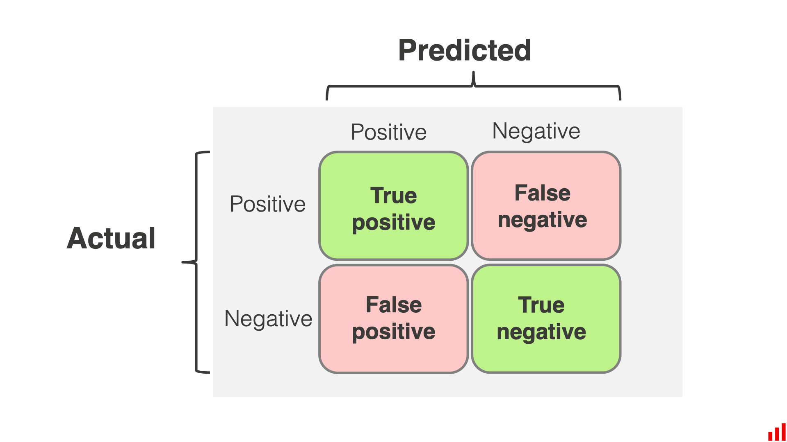

# Redes Neurais

## Algoritmos de Machine Learning

| Tipo            | Exemplo 1           | Exemplo 2            |
| --------------- | ------------------- | -------------------- |
| Regression      | Logistic Regression | Linear Regression    |
| Decision Tree   | CART                | ID3                  |
| Clustering      | Naive Bayes         | Gaussian Naive Bayes |
| Neural Networks | Back Propagation    | Convolution (CNN)    |

## Conceitos de redes neurais

### Hiperparâmetros

Parâmetros que diferem em cada rede que influenciam o treinamento da mesma.

Parâmetros obrigatórios:

* Número de input nodes;
* Número de hidden layers;
* Número de hidden nodes nas hidden layers;
* Número de output nodes;
* Weights;
* Bias;
* Learning Rate.


Input nodes representa uma feature. Supondo uma rede neural de reconhecimento de imagem, cada input node corresponderia a um pixel de imagem.


***

Uma rede neural contém 3 partes: _input layer, hidden layer e output layer_.

<figure><figcaption>
Layers de rede neural
</figcaption></figure>

As redes neurais pode ser do tipo:

1. Feedforward: Os sinais trafegam em uma só direção, da Input Layer a Output Layer. Exemplo: **convolution neural network** **(CNN ou ConvNet)**;
2. Feedback: Os sinais Trafegam em ambas as diferentes. Exemplo: **recurrent neural networks (RNN).**

## Matemática de Redes Neurais


Dividida em 5 partes: propagação, cálculo do erro, cálculo dos gradientes, checagem dos gradientes, atualização dos pesos.


### Forward Propagation

Dividida em 2 etapas: **operação de soma** e **função de ativação**.

Cada nó na hidden layer ou output layer usará o operador de soma para somar todos os inputs conectado a ele e produzir um **net input**.

$$
netinput=bias+\sum x*w
$$

em que _x_ é o nó em questão e _w_ é o peso do nó.

<figure><figcaption>
Forward propagation
</figcaption></figure>

O resultado da operação de soma é usado na **função de ativação**.

<figure><figcaption>
Funções de Ativação
</figcaption></figure>

### Cálculo do Erro

O cálculo do erro de uma rede neural é feito pela diferença do output desejado e output real de todos os nós de output. O erro total é calculado considerando todos os exemplos de treinamento da rede.

Tipos de fórmulas do erro total:

* Mean Squared Error: Erros são elavados ao quadrado, somados e dividos pelo número de exemplos.
* Squared Error: Igual ao primeiro, mas a somatória dos erros é dividida por 2.
* Root Mean Square: Igual ao primeiro, mas o resultado é a raiz quadrada da média.

### Cálculo do Gradiente

O cálculo de gradientes é a distribuição do erro total de uma rede entre os pesos da mesma.

O gradiente é a derivada parcial de um peso em relação ao erro total. **O gradiente nos diz o quanto uma mudança em determinado peso afeta o erro da rede.**

O gradiente de uma layer depende do cálculo dos gradientes das layers mais internas.

### Checagem dos gradientes

O gradiente calculado de um peso pode ser comparado com o gradiente estimado.

O gradiente estimado é calculado alterando o peso em questão e calculando o erro total da rede com essa alteração.

$$
Gradiente=\dfrac{Erro(\theta+\epsilon)-Erro(\theta-\epsilon)}{2\epsilon}
$$

em que:

* theta é um vetor contendo todos os pesos da rede.
* epsilon é uma constante geralmente igual a 0,0001 ou 0,00001.
* o valor de epsilon é somente somado ou subtraído do peso desejado.

Com o gradiente estimado e calculado em mãos, obtemos o erro relativo (diferença entre calculado e estimado dividida pelo maior valor entre ambos).

<table><thead><tr><th width="217">Erro relativo</th><th>Indicação</th></tr></thead><tbody><tr><td>> 10^{-2}</td><td>Grandes chances do gradiente estar errado</td></tr><tr><td>&#x3C; 10^{-2}e > 10^{-4}</td><td>Provável que o grandiente está errado</td></tr><tr><td>&#x3C; 10^{-5}e > 10^{-6}</td><td>Gradiente pode estar certo, mas prosseguir com cautela</td></tr><tr><td>\leq 10^{-7}</td><td>Grandes chances do gradiente estar certo</td></tr></tbody></table>
