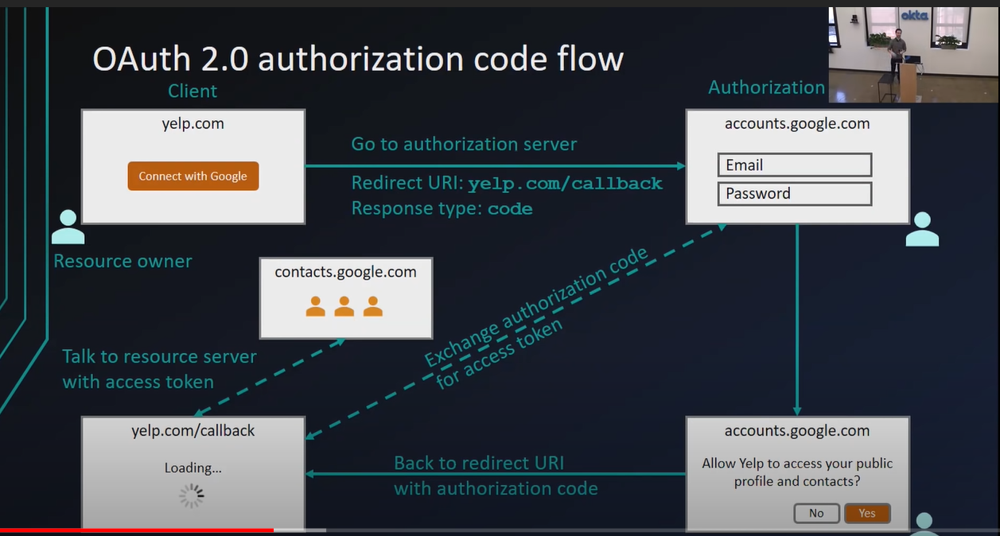

# Segurança: autenticação e autorização

## OAuth 2.0

OAuth é um protocolo de autorização que permite que um serviço autorize o acesso aos dados do usuário por um software terceiro.

> Interessante: se os bancos usassem OAuth, eu não precisaria informar minha senha para o Guiabolso, por exemplo. Aplicativos como o Guiabolso são cases perfeitos para se usar OAuth.

### Fluxo do OAuth 2.0

**Contexto**: a empresa Yelp quer acesso aos seus contatos da Google para enviar uma mensagem incentivando-os a usar a Yelp.

#### Terminologias importantes:

1. _**Client**_**:** a **aplicação que está solicitando os dados**. Nesse caso, o site da Yelp.
2. _**Resource Owner**_: os **dono dos dados** que estão sendo solicitados. Nesse caso, somos nós.
3. _**Authorization Server**_: o serviço que irá realizar a autorização. Nesse caso, uma API da Google \(e.g. accounts.google.com\).
4. _**Resource Server:**_ a API que contém os dados que o Client quer. Nesse caso, é a API de contatos da Google \(e.g. contacts.google.com\).
5. _**Callback URL:**_ a URL que o _Authorization Server_ vai te redirecionar após você confirmar o acesso aos dados.
6. _**Access Token:**_ o que a Client recebe após todo o processo. Um token que é passado ao Resource Server para obter os dados.
7. _**Scope:**_ as permissões que o Client está solicitando. Nesse caso, a Yelp quer acesso de leitura dos nossos contatos.

#### Fluxo:

* A Yelp te mostra um botão, algo como "Conectar com o Google".
* O botão te leva a uma página **da Google**, onde você pode colocar seu e-mail e senha. Aqui, você está enviando dados para o Authorization Server. Além disso, você está enviando uma URL de redirecionamento para a Google.
* A Google te mostra uma página dizendo que a Yelp quer acessar seus **contatos**. 
* Se você aceitar, você é redirecionado ao Callback URL informado na etapa anterior, junto com um **Authorization Code**.
* A Yelp agora envia o Authorization Code ao Authorization Server e pede o Access Token.
* De posse do Access Token, a Yelp agora consegue pedir ao Resource Server os seus contatos.

### Client ID/Client Secret

Para tudo isso funcionar, a Yelp precisa "se cadastrar" no serviço OAuth da Google. Assim, ela recebe um Client ID e um Client Secret.

* Client ID: informado pela Yelp ao Authorization Server na URL, junto com a Callback URL, scope, etc. Importante: essas informações não são sensíveis, por isso podem ser trafegadas pelo browser.
* Client Secret: informado pela Yelp ao Authorization Server **pelo backend** através de uma requisição POST. É uma informação **confidencial**, por isso não pode ser passada pelo browser.

## OpenID Connect e para que serve

O OAuth resolve os problemas de **autorização, mas não de autenticação**. Ou seja, o Access Token serve para **autorizar** a Yelp a consultar os nossos contatos, mas a Yelp não conhece dados sobre nós, como o nosso e-mail \(nós não estamos **autenticados**\). Com o OpenID Connect, o Authorization Server também retorna um **Token ID** \(um JWT\), contendo informações do usuário para que a Yelp saiba que somos nós.

## Definições

### IAM

> **Identity and access management \(IAM\)** is the discipline that enables the right individuals to access the right resources at the right times for the right reasons \([fonte](https://www.gartner.com/en/information-technology/glossary/identity-and-access-management-iam)\).

### **SSO**

**Single Sing On \(SSO\)** é uma ferramenta de autenticação que permite que um usuário se autentique em **múltiplos sistemas de uma organização** com um único login/senha. SSO permite que eu tenha acesso a Google Agenda, Google Meet e GMail me autenticando somente uma vez, mesmo esses sendo sistemas/aplicações completamente distintas. SSO é uma parte de um sistema IAM.

[Artigo sobre SSO](https://www.okta.com/blog/2021/02/single-sign-on-sso/)

> SSO is built on the concept of federated identity, which is the **sharing of identity attributes across trusted but autonomous systems**. When a user is trusted by one system, they are automatically granted access to all others that have established a trusted relationship with it.

### FIM

_Federated identity management_ é um contrato feito por diferentes empresas que permite que usuários acessem diferentes aplicações com as mesmas credenciais. A diferença entra FIM e SSO é que, enquanto SSO autentica usuários em diferentes aplicações **da mesma empresa**, FIM é usado para fazer o mesmo em aplicações **de diferentes empresas**.

> As a solution, FIM was developed as a set of agreements and standards that help enterprises and applications share user identities. Essentially, it’s an arrangement that can be made among multiple organizations so that subscribers can use the same identifiers to access various applications.

### SAML

A Security Assertion Markup Language é responsável por permitir a **comunicação** entre _Identity Providers_ e _Service Providers_. Os _Identity Providers_ são os sistemas que fazem a autorização do usuário \(o sistema em que o usuário coloca suas credenciais\), e os _Service Providers_ são os serviços que o usuário está tentando acessar.

[Artigo sobre SAML.](https://www.okta.com/blog/2020/09/what-is-saml/)

> SAML, therefore, is the link between the authentication of a user’s identity and the authorization to use a service. It’s the language that helps IdPs and SPs communicate. When an employer \(the IdP\) and a SaaS company \(the SP\) both implement SAML, they are able to seamlessly authenticate accredited users.

### OAuth x SAML x OpenID

Esses três conceitos são diferentes, e usados em situações distintas \([fonte](https://www.okta.com/identity-101/whats-the-difference-between-oauth-openid-connect-and-saml/)\).

* OAuth é um meio de **autorizar** que aplicações terceiras acessem recursos específicos de um sistema. 
* Como OAuth não lida com autenticação, temos o OpenID para essa tarefa. O OpenID usa tokens JWT para enviar informações sobre o usuário para a aplicação terceira. OAuth e OpenID podem ser \(e geralmente são\) usados em conjunto.
* SAML está mais relacionado ao SSO. Provê autenticação e autorização de usuários ao sistema.

## Keycloak

> Sistema externo especializado em lidar com autorização

[Documentação](https://www.keycloak.org/docs/latest/server_admin/#overview)

Usado como _Authorization Server._ Trata-se de um outro servidor no sistema, com o propósito de autenticar e autorizar o usuário. Como os usuários são redirecionados do browser ao servidor onde informam suas credencias, o browser não tem conhecimento dessas informações. O _Authorization Server_  retorna um **token** com informações do usuário \(nome, e-mail, etc\), além das suas **permissões**.

